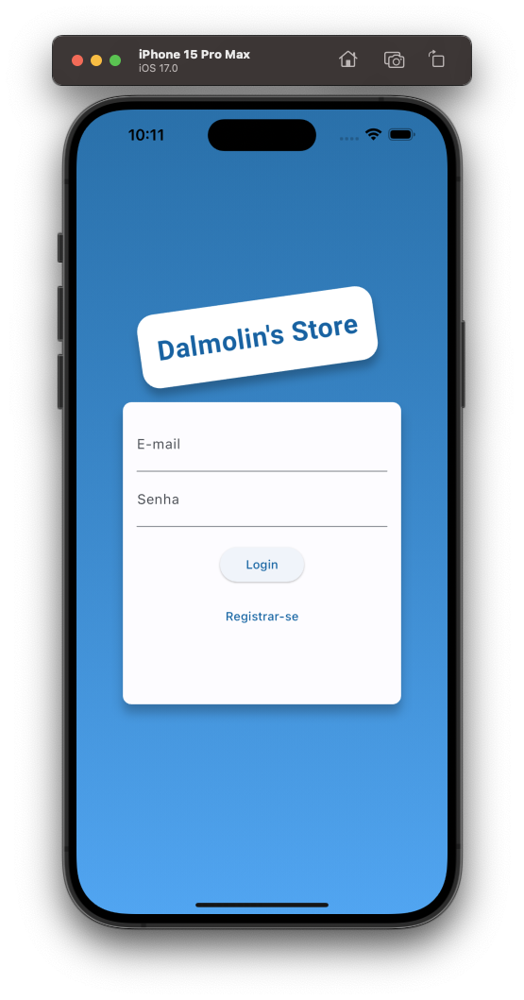
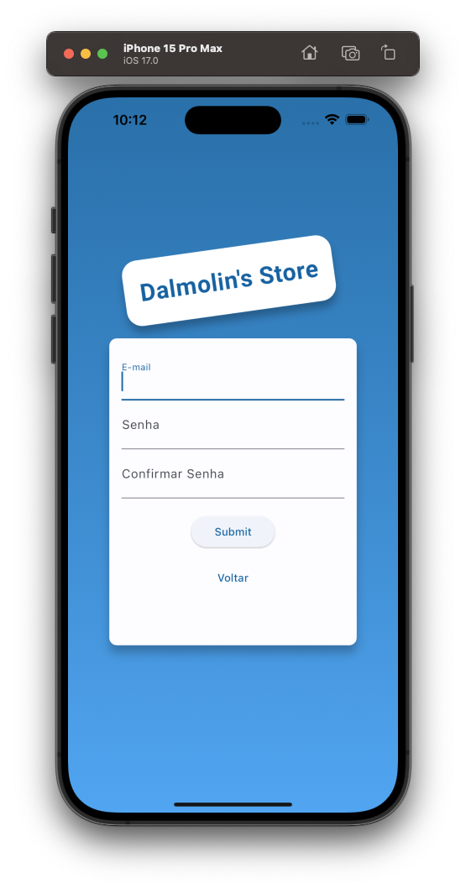
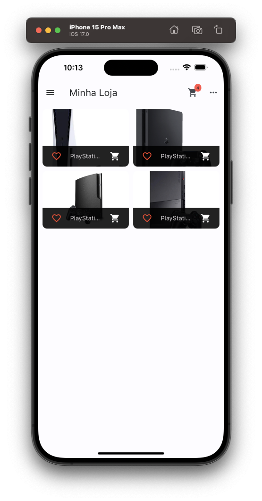
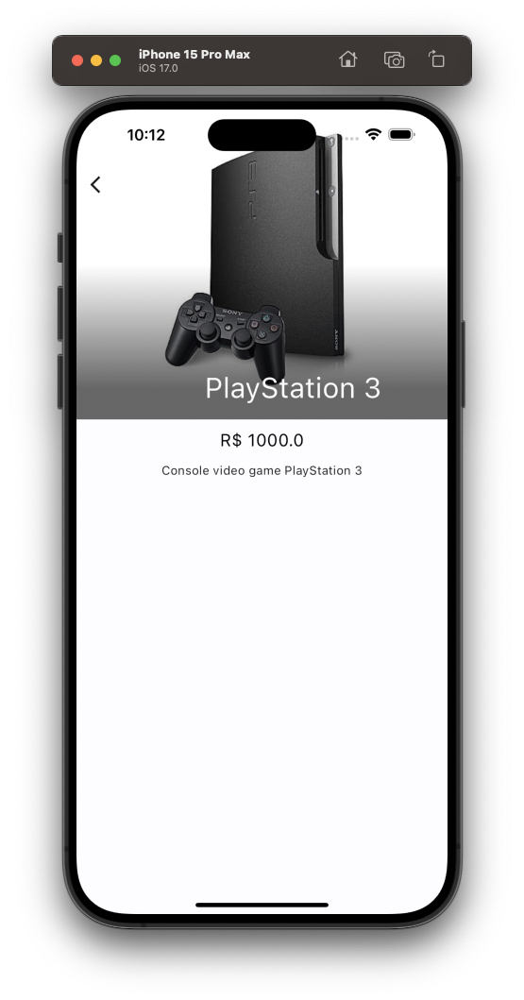
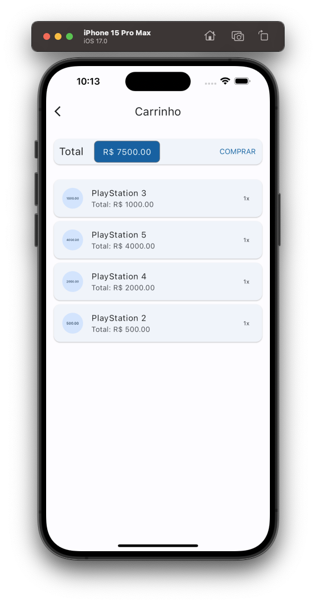
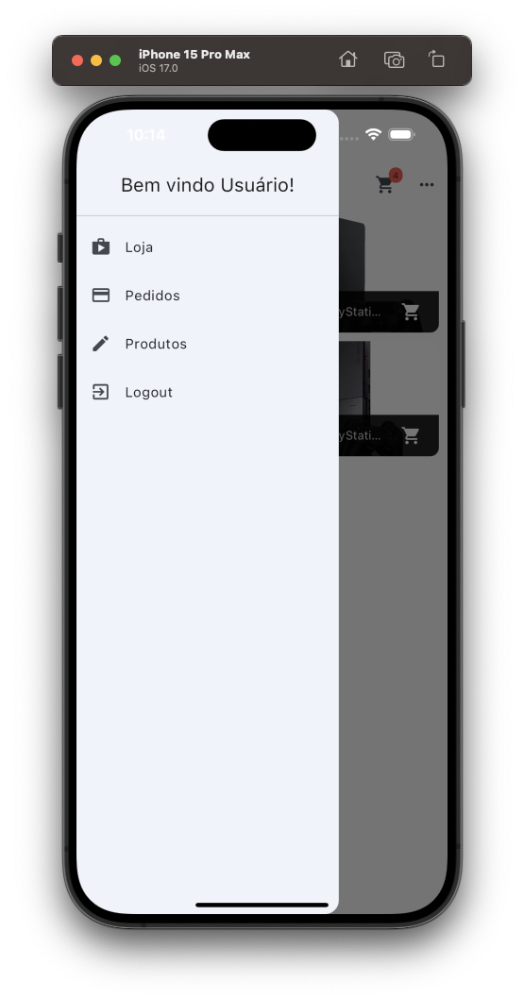
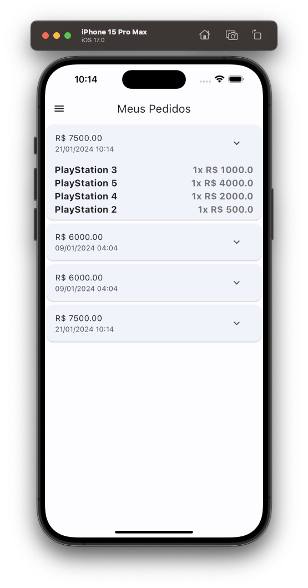
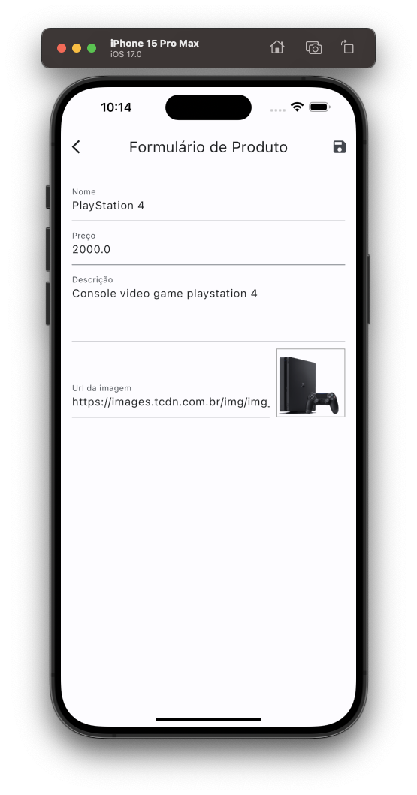
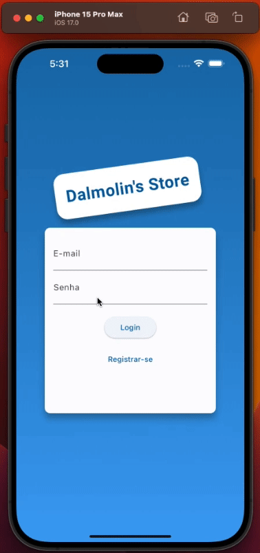
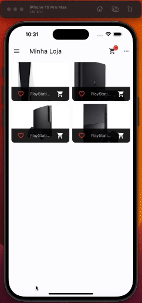

---

## Shop App (In progress)

---

<div align="center">

**Language:**

[](README.md)
[](README.pt-br.md)

</div>

---
## ℹ️ About this repository
Mobile application for managing an online store.

This repository's main objective is to demonstrate the application developed to train my knowledge during the Flutter course from the company [COD3R](https://www.udemy.com/course/curso-flutter/).

---
## ⚙️ Features
This app has the following features for managing a store:

- Integration with Firebase.
- User authentication.
- Product Management.
- Product cart management per user.
- Order Management per user.

---
## 👁️ Preview
<h1 align="center">
    
    
    
</h1>

<h1 align="center">
    
    
    
</h1>

<h1 align="center">
    
    
    
</h1>

<h1 align="center">


</h1>

---
 ## 🧪 Technologies
This project was developed using the following technologies:

- [Flutter 3.16.7](https://docs.flutter.dev/)
- [Dart 3.2.4](https://dart.dev/)
- [Intl](https://pub.dev/packages/intl)
- [Google_Fonts](https://pub.dev/packages/google_fonts)
- [Http](https://pub.dev/packages/http)
- [Provider](https://pub.dev/packages/provider)
- [Shared Preferences](https://pub.dev/packages/shared_preferences)

---
## ⚡ Installing

Clone this project using

```bash
  git clone https://github.com/GoedertDalmolin/shop.git
  cd shop
```

Access the firebase_config.dart file using:

```bash
  cd shop/lib/utils/firebase_config.dart
```

Take your credentials listed in the project configuration within the Firebase console and replace them in their respective String variables (urlDatabase and apiKey).

```dart
class FirebaseConfig {
  // Put your DataBase URL here
  static String urlDatabase = 'YOUR-FIREBASE-DATABASE-URL';
  static String apiKey = 'YOUR-FIREBASE-API-KEY';
}
```

Finally compile and run the project.

---
</> Developed by [GoedertDalmolin](https://github.com/GoedertDalmolin) 👋
---
