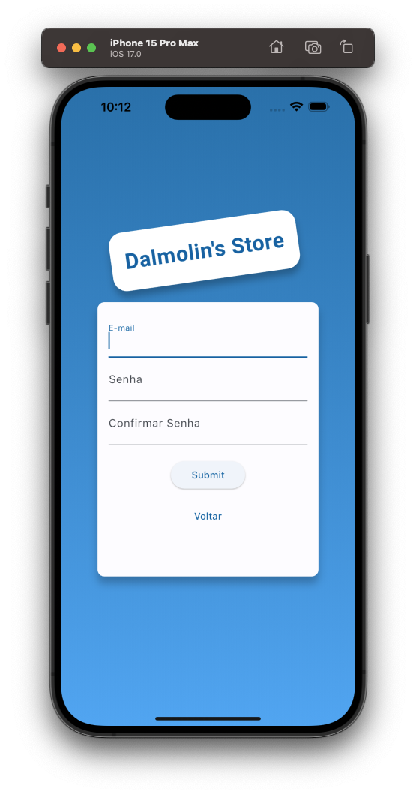
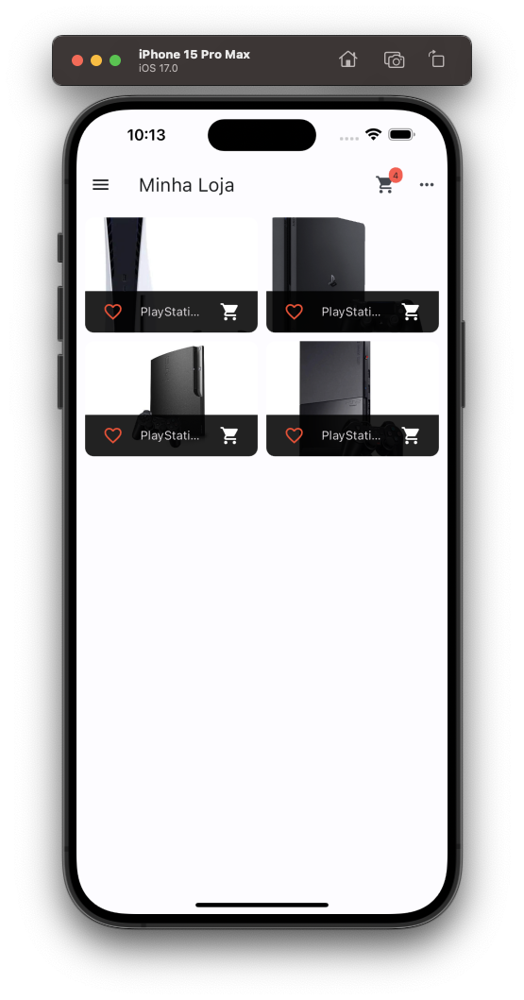
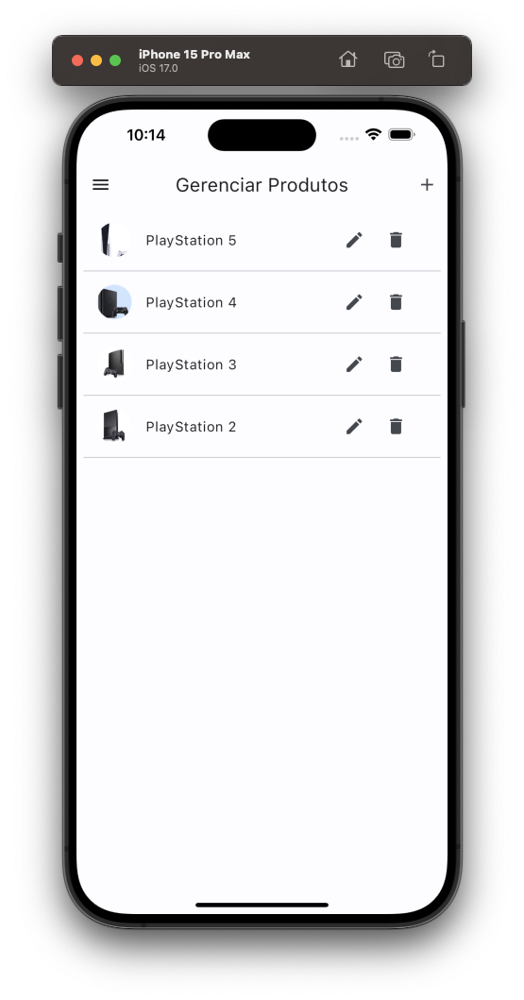
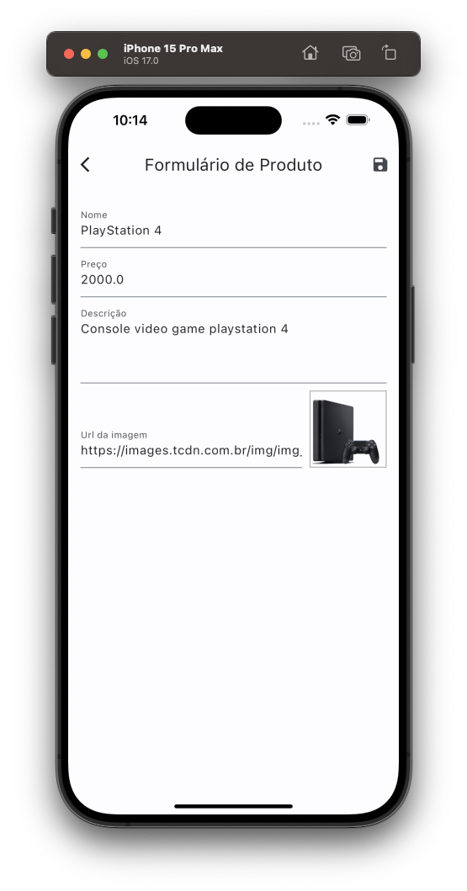

---

## Shop App

---

<div align="center">

**Language:**

[](README.md)
[](README.pt-br.md)

</div>

---
## ℹ️ Sobre este repositório
Aplicativo mobile para gerenciamento de uma loja virtual.

O objetivo principal deste repositório é demonstrar o aplicativo desenvolvido para treinar meus conhecimentos durante o curso de Flutter da empresa [COD3R](https://www.udemy.com/course/curso-flutter/).

---
## ⚙️ Funcionalidades
Este app tem as seguintes funcionalidades dentro do gerenciamento de uma loja:

- Integração com Firebase.
- Autenticação de usuário.
- Gerenciamento de Produtos.
- Gerenciamento de Carrinho de produtos por usuário.
- Gerenciamento de Pedidos por usuário.

---
## 👁️ Pré-visualização
<h1 align="center">


</h1>

<h1 align="center">
    
    
    
</h1>

<h1 align="center">
    
    
    
</h1>

<h1 align="center">
    
    
    
</h1>

---
## 🧪 Tecnologias
Este projeto foi desenvolvido usando as seguintes tecnologias:

- [Flutter 3.16.7](https://docs.flutter.dev/)
- [Dart 3.2.4](https://dart.dev/)
- [Intl](https://pub.dev/packages/intl)
- [Google_Fonts](https://pub.dev/packages/google_fonts)
- [Http](https://pub.dev/packages/http)
- [Provider](https://pub.dev/packages/provider)
- [Shared Preferences](https://pub.dev/packages/shared_preferences)

---
## ⚡ Instalação

Primeiramente clone este projeto usando:

```bash
  git clone https://github.com/GoedertDalmolin/shop.git
  cd shop
```

Acesse o arquivo firebase_config.dart usando:

```bash
  cd shop/lib/utils/firebase_config.dart
```

Pegue suas credenciais listadas na configuração do projeto dentro do console do Firebase e substitua nas suas respectivas variáveis String (urlDatabase e apiKey).

```dart
class FirebaseConfig {
  // Put your DataBase URL here
  static String urlDatabase = 'YOUR-FIREBASE-DATABASE-URL';
  static String apiKey = 'YOUR-FIREBASE-API-KEY';
}
```

Por fim compile e execute o projeto.

---
</> Desenvolvido por [GoedertDalmolin](https://github.com/GoedertDalmolin) 👋
---
